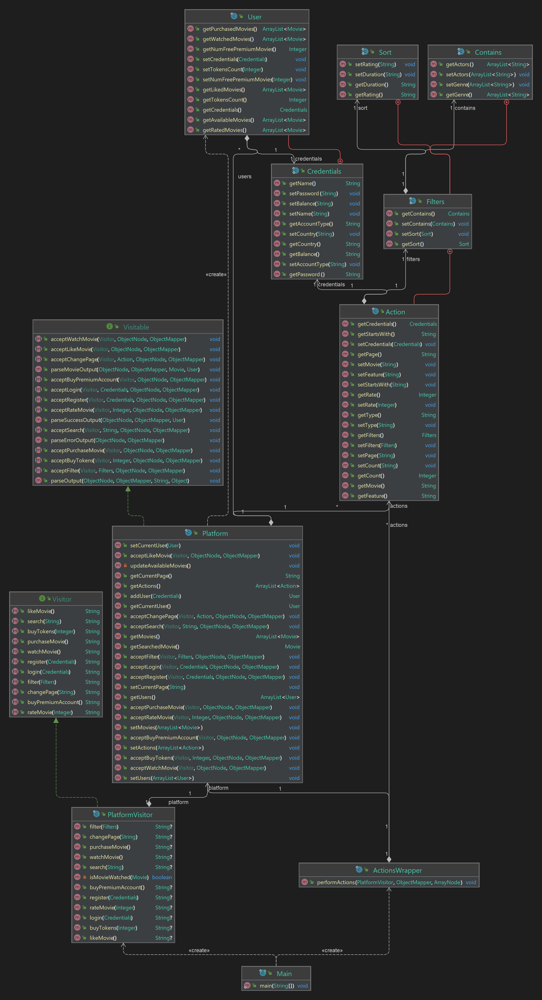

## Milestone 1 POO TV - Robert Vulpe, 323CD

### Short description about main functionalities
This first milestone assumes the implementation of a simple backend for a streaming platform
similar with Netflix or HBO GO. The actions that a user will be able to perform are: register,
login, logout, search, filter, buy movie, view movie, like movie, rate movie, buy premium account,
buy tokens and switch between different pages where all these activities are available. Those
steps are received at the input, which is a ***.json*** file whose content will be deserialized
into a Java object that represents the platform. Also, each user is identified by his/her credentials 
and will have a different perspective of the platform depending on the country from which they 
connect to it. 

### Implementation and design details
I started the implementation by creating a class `Platform` where I will store all the information
about it: the registered users, current available movies, current user that is logged in, the page
that the current user is on and a list of all the actions that will be performed. The actions
will be separately processed with the help of the `ActionsWrapper` class. For now, we have two
types of activities that can be completed:

- `change page` will change the current page to the specified destination page
- `on page` will perform an action on the current page

To be able to have an easy to extend design, I used the Visitor pattern in the implementation of these
two functionalities. Thus, I created an interface `Visitable` which will be implemented by the `Platform`
class and will contain all the methods that accept the actions performed by the user. On the other hand,
I defined the `Visitor` interface that is implemented by `PlatformVisitor` class where we have the definitions 
for all the actions that the current user can do. This thing enables a modular setup, where functionality can
be easily added in the future without affecting the `Platform` object structure. Also, each action is
encapsulated together with its own data and depends only on the `Platform` instance that is being processed.
The `ActionsWrapper` class defines the `performActions()` method, which is technically a parser that decides
which command should be executed according to the input received from the user. After that, it writes at the 
output the generated result if the action performs successfully or a predefined standard error output in case 
of error. You can take a look at the diagram below to better understand the project's structure described earlier. 

### Conclusions
It was an interesting challenge to develop this first milestone. I learned how to apply the Visitor design pattern
in a practical situation and also improved my understanding of some important OOP concepts(for example working with
inner classes or lambda expressions). Some important resources that I found useful in making this project are:
[Visitor design pattern](https://www.geeksforgeeks.org/visitor-design-pattern/), 
[Laboratorul 5: Abstractizare](https://ocw.cs.pub.ro/courses/poo-ca-cd/laboratoare/clase-abstracte-interfete), 
[Laboratorul 6: Clase interne](https://ocw.cs.pub.ro/courses/poo-ca-cd/laboratoare/clase-interne) and 
[Laboratorul 7: Overriding, overloading & Visitor pattern](https://ocw.cs.pub.ro/courses/poo-ca-cd/laboratoare/visitor).

